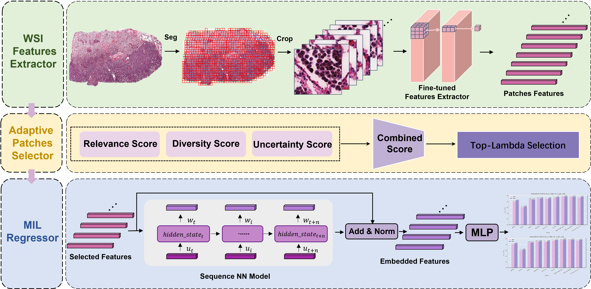
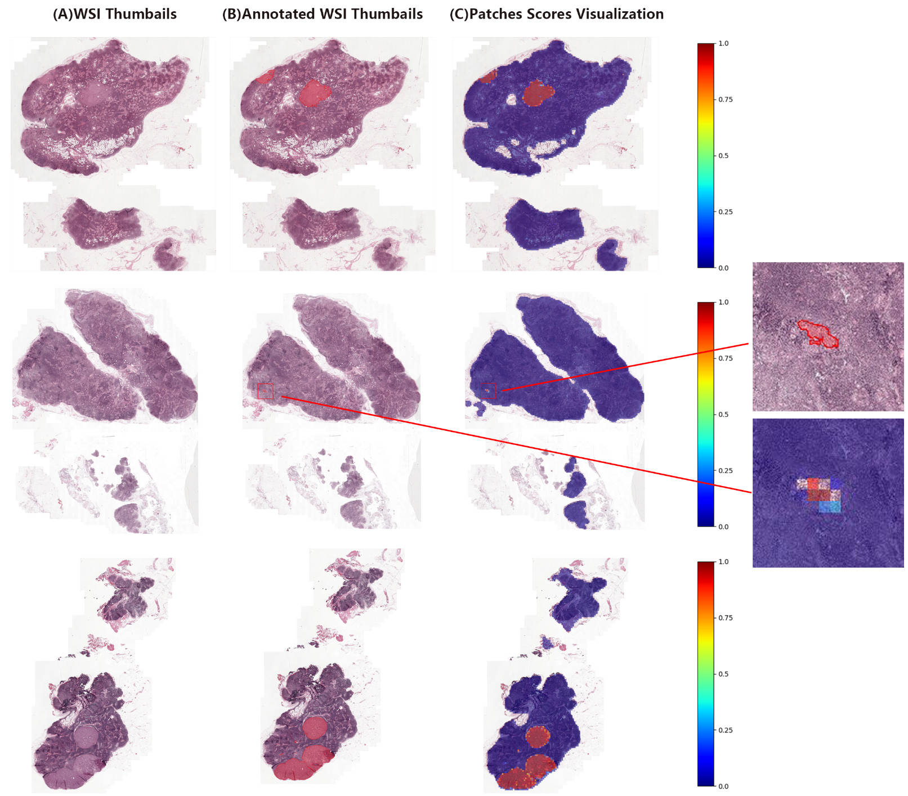

# EfficientMIL: Efficient Linear-Complexity MIL Method for WSI Classification

## Summary

Whole slide images (WSIs) classification represents a fundamental challenge in computational pathology, where multiple instance learning (MIL) has emerged as the dominant paradigm. Current state-of-the-art (SOTA) MIL methods rely on attention mechanisms, achieving good performance but requiring substantial computational resources due to quadratic complexity when processing hundreds of thousands of patches. To address this computational bottleneck, we introduce EfficientMIL, a novel linear-complexity MIL approach for WSIs classification with the patches selection module Adaptive Patches Selector (APS) that we designed, replacing the quadratic-complexity self-attention mechanisms in Transformer-based MIL methods with efficient sequence models including RNN-based GRU, LSTM, and State Space Model (SSM) Mamba. EfficientMIL achieves significant computational efficiency improvements while outperforming other MIL methods across multiple histopathology datasets. On TCGA-Lung dataset, EfficientMIL-Mamba achieved AUC of 0.976 and accuracy of 0.933, while on CAMELYON16 dataset, EfficientMIL-GRU achieved AUC of 0.990 and accuracy of 0.975, surpassing previous state-of-the-art methods. Extensive experiments demonstrate that APS is also more effective for patches selection than conventional selection strategies.

## Graphical Abstract



## Installation

### Prerequisites
- Python 3.9+
- PyTorch 1.8+
- CUDA (for GPU training)

### Setup
```bash
# Clone repository
git clone https://github.com/chengyingshe/EfficientMIL.git
cd EfficientMIL

# Optional: create Anaconda env
conda create -n efficientmil python=3.9 -y
conda activate efficientmil

# Install mamba
pip install -e requirements/causal_conv1d
pip install -e requirements/mamba-1p1p1

# Install other dependencies
pip install -r requirements/requirements.txt
```

## Dataset Preparation

This section provides a comprehensive guide for preparing WSI datasets for training EfficientMIL models.

### Step 1: Download WSI Images

#### Option A: Download CAMELYON16 Dataset

1. **Install AWS CLI** (required for downloading CAMELYON16):
   ```bash
   curl "https://awscli.amazonaws.com/awscli-exe-linux-x86_64.zip" -o "awscliv2.zip"
   unzip awscliv2.zip
   ./aws/install
   ```

2. **Download CAMELYON16 dataset**:
   ```bash
   # Create dataset directory
   mkdir -p datasets
   
   # Download the whole CAMELYON16 dataset
   aws s3 sync s3://camelyon-dataset/CAMELYON16 datasets/CAMELYON16 --no-sign-request
   ```

#### Option B: Download TCGA Dataset

1. **Install GDC Client** (automatically installed by the script):
   ```bash
   bash scripts/download_tcga_lung.sh
   ```

2. **Or download TCGA features directly**:
   - Download from [HuggingFace UNI2 features](https://huggingface.co/datasets/MahmoodLab/UNI2-h-features)
   - Convert `.h5` format to `.pt` format using: `python scripts/convert_h5_to_pt.py`

#### Option C: Use Your Own WSI Data

Place your WSI files (`.tif`, `.svs`, `.ndpi`, etc.) in the following structure:
```
datasets/mydatasets/YourDataset/
└── wsi/
    ├── slide_001.tif
    ├── slide_002.tif
    └── ...
```

### Step 2: Preprocess WSI Images

The preprocessing pipeline consists of two main steps: patch creation and feature extraction.

#### 2.1 Create Patches from WSI

Run the patch creation script to extract patches from WSI images:

```bash
# Navigate to the features extractor directory
cd wsi_features_extractor/scripts/

# Edit the configuration in run_create_patches_fp.sh
# Update the following variables:
# - save_dir: Directory to save patch coordinates
# - wsi_dir: Directory containing WSI files
# - wsi_format: Format of your WSI files (tif, svs, ndpi, etc.)

# Run the patch creation script
bash run_create_patches_fp.sh
```

**Configuration Example** (in `run_create_patches_fp.sh`):
```bash
# The coordinates of the patches are saved
save_dir="/home/scy/changhai_project/wsi/EfficientMIL/datasets/mydatasets/camelyon16-temp/patches"

# The directory where the WSI files are stored
wsi_dir="/home/scy/changhai_project/wsi/EfficientMIL/datasets/mydatasets/camelyon16-temp/wsi"

# The WSI format
wsi_format="tif"
```

#### 2.2 Extract Features from Patches

Run the feature extraction script to generate feature vectors:

```bash
# Edit the configuration in run_extract_features_fp.sh
# Update the following variables:
# - wsi_dir: Directory containing WSI files
# - feat_dir: Directory to save feature vectors
# - coors_dir: Directory containing patch coordinates
# - models: Foundation model to use (e.g., "uni2", "gpfm")

# Run the feature extraction script
bash run_extract_features_fp.sh
```

**Configuration Example** (in `run_extract_features_fp.sh`):
```bash
# Task name
TASK_NAME=Task_C16_UNI2
# WSI format
slide_ext=.tif 
# Directory containing WSI files
wsi_dir=/home/scy/changhai_project/wsi/EfficientMIL/datasets/mydatasets/camelyon16-temp/wsi
# Feature output directory (.pt files)
feat_dir=/home/scy/changhai_project/wsi/EfficientMIL/datasets/mydatasets/camelyon16-temp/patches  
coors_dir=/home/scy/changhai_project/wsi/EfficientMIL/datasets/mydatasets/camelyon16-temp/patches  # Patch coordinates directory (.h5 files)
# Foundation model to use
models="uni2"
# python interpreter
python_envs=/home/scy/anaconda3/envs/gpfm/bin/python
```

### Step 3: Organize Feature Files

After feature extraction, organize your files in the following structure:

```
datasets/mydatasets/
├── TCGA-lung/
│   ├── pt_files/              # Feature vectors (.pt files)
│   │   ├── TCGA-XX-XXXX.pt
│   │   ├── TCGA-XX-XXXX.pt
│   │   └── ...
│   └── TCGA.csv               # Dataset labels
│
├── CAMELYON16/
│   ├── pt_files/              # Feature vectors (.pt files)
│   │   ├── normal_001.pt
│   │   ├── tumor_001.pt
│   │   └── ...
│   └── Camelyon16.csv         # Dataset labels
│
└── YourDataset/
    ├── pt_files/              # Feature vectors (.pt files)
    └── YourDataset.csv        # Dataset labels
```

**Label File Format** (CSV):
```csv
case_id,label
TCGA-XX-XXXX,0
TCGA-XX-XXXX,1
normal_001,0
tumor_001,1
```

### Step 4: Verify Dataset Preparation

Check that your dataset is properly prepared:

```bash
# Check feature files
ls datasets/mydatasets/YourDataset/pt_files/ | wc -l

# Check label file
head datasets/mydatasets/YourDataset/YourDataset.csv

# Verify feature file format
python -c "
import torch
feat = torch.load('datasets/mydatasets/YourDataset/pt_files/sample.pt')
print(f'Feature shape: {feat.shape}')
print(f'Feature type: {feat.dtype}')
"
```

## Training

### Step 5: Train EfficientMIL Models

After completing the dataset preparation, you can train EfficientMIL models using the `train.py` script.

#### Basic Training Commands

**For Example: Train EfficientMIL-GRU on TCGA Lung dataset:**
```bash
python train.py \
    --model efficientmil_gru \
    --dataset_dir datasets/mydatasets/TCGA-lung \
    --label_file TCGA.csv \
    --num_classes 2 \
    --num_folds 5 \
    --train_folds all
```

#### Advanced Training Options

**Training with custom parameters:**
```bash
python train.py \
    --model efficientmil_gru \
    --dataset_dir datasets/mydatasets/TCGA-lung \
    --label_file TCGA.csv \
    --num_classes 2 \
    --num_folds 5 \
    --train_folds all \
    --lr 0.0001 \
    --num_epochs 100 \
    --batch_size 1 \
    --feats_size 1536 \
    --dropout 0.1 \
    --gru_hidden_size 768 \
    --gru_num_layers 2 \
    --big_lambda 64 \
    --save_dir outputs/efficientmil_gru_tcga \
    --device cuda:0
```

**Training specific folds only:**
```bash
# Train only folds 1, 3, and 5
python train.py \
    --model efficientmil_gru \
    --dataset_dir datasets/mydatasets/TCGA-lung \
    --label_file TCGA.csv \
    --num_classes 2 \
    --num_folds 5 \
    --train_folds "1,3,5"
```

#### Training Output

The training script will create the following output structure:
```
outputs/
└── efficientmil_gru_tcga/
    ├── weights/
    │   ├── fold_1
    │   |   ├── best.pt             # best epoch checkpoint
    │   |   └── last.pt             # last epoch checkpoint
    │   ├── fold_2
    │   ├── fold_3
    │   └── ...
    ├── log.txt                     # Training logs
    └── tensorboard/                # tensorboard log
```

## Visualization

### Step 6: Generate WSI Visualizations

The `visualization.py` script generates patch-level score visualizations for WSI analysis, helping you understand which regions of the slide are most important for the model's predictions.

#### Basic Visualization Commands

**For Example: Visualize a single WSI:**
```bash
python visualization.py \
    --model efficientmil_gru \
    --model_weights outputs/efficientmil_gru_tcga/weights/fold_0_best.pth \
    --wsi_id tumor_016 \
    --wsi_format tif \
    --wsi_dir ./sample_wsi \
    --feats_size 1536 \
    --num_classes 2
```



## Acknowledgement

This codebase is built on the work of [Snuffy](https://github.com/jafarinia/snuffy), [dsmil-wsi](https://github.com/binli123/dsmil-wsi), [PrePATH](https://github.com/birkhoffkiki/PrePATH), [Vim](https://github.com/hustvl/Vim)

## Preprint and Citation

If you use this code in your research, please cite:

Our preprint is avaible on [arXiv](https://arxiv.org/abs/2509.23640) with the following citation:

```bibtex
@misc{she2025_efficientmil,
      title={EfficientMIL: Efficient Linear-Complexity MIL Method for WSI Classification}, 
      author={Chengying She and Chengwei Chen and Dongjie Fan and Lizhuang Liu and Chengwei Shao and Yun Bian and Ben Wang and Xinran Zhang},
      year={2025},
      eprint={2509.23640},
      archivePrefix={arXiv},
      primaryClass={cs.CV},
      url={https://arxiv.org/abs/2509.23640}, 
}
```


